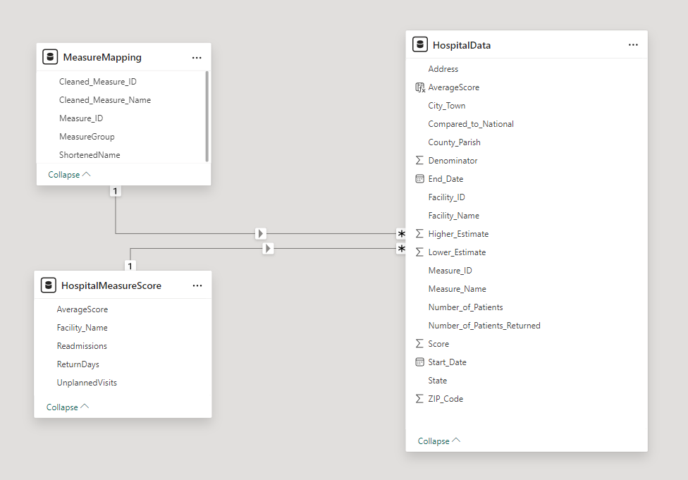
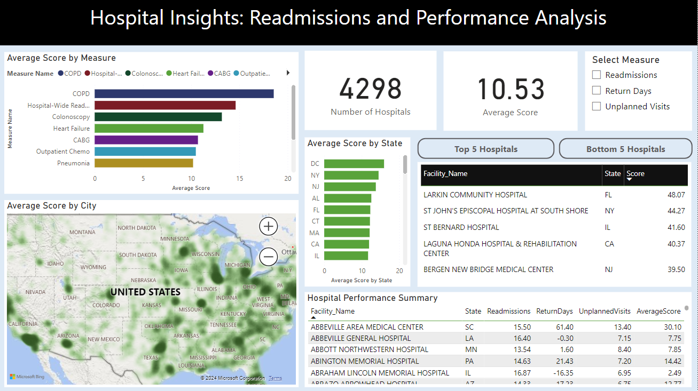

# Project Background
This project analyzes hospital readmissions data with the goal of identifying patterns and insights related to hospital performance. The findings are targeted at hospital administrators aiming to improve performance and CMS policymakers considering regional trends. The project aims to provide actionable insights that will help healthcare institutions improve patient outcomes, focusing on three primary measures:
1. Excess Days in Acute Care (EDAC), or return days,
2. Unplanned Readmissions following inpatient admissions, and
3. Unplanned Visits after outpatient procedures.
These measures provide insight into hospital quality and patient outcomes without requiring manual reporting from hospitals. Instead, they are calculated using Medicare claims and eligibility data, with data for some conditions (such as COPD, heart attack, heart failure, pneumonia, hip/knee replacement, and others) also sourced from VHA data. This claims-based approach offers comparable accuracy to chart reviews when calculating readmission and hospital visit rates.

An interactive Power BI dashboard can be downloaded [here](https://app.powerbi.com/reportEmbed?reportId=e3c16950-05f5-44e6-9b0d-e5b45fb75b83&autoAuth=true&ctid=84dffbf0-87f4-408c-b699-3873cc88cd2f).

The SQL queries utilized to clean, organize, and prepare data for the dashboard can be found [here](https://github.com/ManalotoM/Hospital-Readmissions/blob/main/Cleaning.sql).

The SQL queries regarding various business questions can be found [here](https://github.com/ManalotoM/Hospital-Readmissions/blob/main/Analysis.sql).

The scores are standardized based on national expectations to clarify their purpose in evaluating performance.

# Data Structure Overview

# Data Import and Cleaning
The raw dataset was imported into SQL Server, where initial cleaning steps were taken to ensure data quality. The steps involved:
- Identifying null values, "Not Applicable," and "Not Available" entries across key columns.
- Removing rows with null or unavailable values in critical fields like Denominator and Score.
- Dropping unnecessary columns, such as Footnote and Telephone_Number.

In Cleaning.sql, a custom table called MeasureMapping was created to map technical measure IDs to user-friendly names. Each measure, such as "Readmission Rate after Hip/Knee Replacement" or "Heart Failure 30-Day Readmission Rate," was given a readable name to improve the clarity of analysis and visualizations. Additionally, a MeasureGroup field was added to categorize measures into groups Readmissions, Return Days, and Unplanned Visits.

In Analysis.sql, the HospitalMeasureScore table was created to summarize performance metrics for hospitals by grouping measures like "Return Days," "Unplanned Visits," and "Readmissions." It includes an additional column for the average score, calculated dynamically based on available values for each measure, allowing for a comprehensive comparison across hospitals.

# Insights Summary
**Regional Trends**
For all measures, the hospitals with the best average performing scores were in the northern and western region, including Utah, Idaho, and Montana. These scores ranged from 4.36 (Utah) to 7.55 (Colorado). The states with the worst performing averages were all in the east coast and the south, with the top worst two being District of Columbia (15.96) and New York (14.50)

**Top and Worst Performers**
Across all measures, southern states have the best performing hospitals, particularly Texas, Georgia, and Indiana. New York had one top five performer in readmissions and unplanned visits - Hosptial for Special Surgery.

Unplanned visits had mostly hospitals in midwestern states - Michigan, Iowa, and Kansas. For readmissions and return days, New York had two bottom 5 performers, with the rest including Kentucky, Connecticut, New Jersey, Florida, and California.

# Recommmendations
**Focus on Low-Performing Regions:** Prioritize interventions in the East Coast and South, especially New York, DC, and Florida, to address systemic challenges with post-discharge care and patient outcomes. Implement region-specific improvement plans, such as enhanced post-discharge follow-up, patient education programs, and investments in infrastructure and staffing.
**Leverage High-Performing States:** Replicate best practices from top states like Utah and Montana by sharing strategies and resources with underperforming hospitals. By adopting proven practices, struggling hospitals can achieve meaningful improvements in their outcomes.
**Specialized Support for New York Hospitals:** Investigate why some New York hospitals, like the Hospital for Special Surgery, outperform others in the same state. Focus on lifting bottom-performing hospitals through tailored strategies, such as leadership support, operational changes, and targeted funding.

**Score Definition and Adjustment**
Each hospital’s Score represents the number of observed events—readmissions, return days, or unplanned visits—attributed to its performance. This score is risk-adjusted to account for patient characteristics such as age, medical history, and comorbidities that may increase readmission likelihood, allowing for fairer comparisons between hospitals.

For each measure:
- Readmission and hospital visit rates are compared to a national benchmark. Hospitals fall into categories based on whether their interval estimate (a 95% confidence interval) is above, below, or within the national average.
- Return days are benchmarked against zero, with hospitals categorized based on whether their result lies above, below, or includes zero.
Hospitals with too few cases for reliable estimates are marked accordingly. This classification framework ensures that results account for variability and are representative of each hospital’s relative performance.

# Dashboard

# Data Source
For more information on the [dataset](https://data.cms.gov/provider-data/dataset/632h-zaca#data-table), please refer to the [CMS dataset documentation]([https://data.cms.gov/provider-data/dataset/632h-zaca#data-table](https://data.cms.gov/provider-data/topics/hospitals/unplanned-hospital-visits)).
